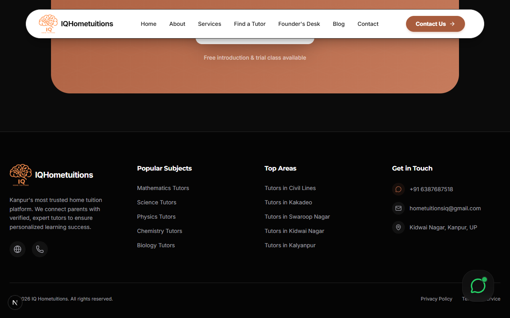

# IQ Hometuitions - Personalized Home Education Platform


IQ Hometuitions is a premium, verified home tuition service based in Kanpur, India. We connect talented students with highly qualified, hand-picked educators tailored to their unique academic needs. Whether preparing for foundational school boards or advanced competitive exams, our mission is to empower minds across the city through personalized mentorship.

## Features

- **Tutor Registration & Matching:** Integrated forms seamlessly connect new educators and students.
- **Verified Educators:** Comprehensive coverage of academic curricula from primary school up to advanced national-level examinations (IIT-JAM, JEE, NEET).
- **Dynamic Frontend:** Built with React, Next.js, and modern styling utilizing Framer Motion for premium aesthetics and fluid animations.
- **Responsive Layout:** Fully optimized for both desktop and mobile devices.

## Tech Stack

- **Framework:** Next.js (App Router)
- **Styling:** Tailwind CSS, Framer Motion (for animations)
- **Icons:** Lucide React
- **Language:** TypeScript

## Setup & Local Development

1. **Clone the repository:**
   ```bash
   git clone https://github.com/RAMAN-SHUKLA/IQHOMETUITIONS.git
   ```

2. **Install dependencies:**
   ```bash
   npm install
   ```

3. **Environment Configuration:**
   Copy the `.env.example` file to create a local `.env` file (which is securely ignored by Git):
   ```bash
   cp .env.example .env
   ```
   *Note: Add any required API keys or secrets (like Google Sheets macro URLs) into your `.env` file.*

4. **Run the development server:**
   ```bash
   npm run dev
   ```
   Open [http://localhost:3000](http://localhost:3000) in your browser.

## Contact & Office Details

**Office:** Kidwai Nagar, Kanpur, Uttar Pradesh 208011, India  
**Email:** [hometuitionsiq@gmail.com](mailto:hometuitionsiq@gmail.com)  


